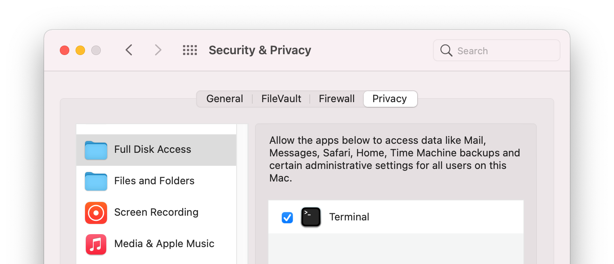

A Complete Mac Setup Tool
=============================

This repository contains an automated build out process targeting macOS.


You can have most of your tools and applications setup in  a fresh install and creating a clean build with little downtime.


This project only looks to get software installed. For applications settings look at solutions like [mackup](https://github.com/lra/mackup) or my [dotfiles](https://github.com/yevrah/dotfiles) restore [script](https://github.com/yevrah/dotfiles/blob/master/bin/restore.sh).

# How To Use

The first step is to make sure that you have captured a list of all software in your desktop. Different types of software require a slightly different approach.

For command line tools like git, node and other tools update the `packages.brew.txt` and `packages.cask.txt` files with:

```bash
brew list
```

From the output, copy any of the **brew** files (all the command line tools) to the `packages.brew.txt` file.


For desktop apps like Firefox, Slack and others copy the **cask** output to `packages.cask.txt`


Some desktop apps can only be installed from the app store. Use the following commands to get a list of Apple Store Apps currently installed on your computer and copy the output to `packages.mas.txt`


```bash
mas list
```


After you have captured all your command line tools and desktop apps into the appropriate text file I recommend you store it somewhere easily reachable. 


I use github, it makes it easy to download an entire repository by selecting "Code -> Download Zip". Simply extract and run the setup command.

```bash
curl https://github.com/yevrah/mac-setup/archive/refs/heads/master.zip -L -o mac-setup.zip
unzip mac-setup.zip

cd mac-setup
./setup.sh
```


### Security Permissions

Note, on new versions of macOS you need to give terminal permission to the disk so it can install software.




## How To Test

It is recommended you test this on a VM first before depending on it for full machine recovery. A few quick iterations will ensure you have captured everything - including various settings and shortcuts you may have missed that can be added to the script.

# How Does It Work

## The Homebrew Workhorse

We are using `brew` (short for homebrew) to do all the heavy lifting, it's
the defacto package manager for Mac. if your not familiar with it head over to
their [website](https://docs.brew.sh/). Homebrew is installed by automatically as we added the
following to the `install.sh`:

```
echo "Installing HomeBrew"
if test ! $(which brew)
then
  ruby -e "$(curl -fsSL https://raw.githubusercontent.com/Homebrew/install/master/install)" > /tmp/homebrew-install.log
fi
```

Because we don't want to continuously reset our vm we added a quick check to see
if it exists and skip or else install. This will be a common theme throughout
our build out process, it also allows us to use the same script to continue to
upgrade and update out machine. By doing this we in theory could do a full
system reset in minimal time.

In adition the following lines are added as well, it will help keeping our
machine up to date.

```
echo "Updating existing homebrew recpies and formulas"
brew update
brew upgrade --all
```

## Installing packages

We are now ready to install
packages. If you have an existing homebrew system you can export your packages
using `brew list > packages.txt`. You'll probably have some items that are no
longer relevant, now is the time to cleanup this list.

Note that there are a bunch of default packages listed in this repo - you may
want ot change to suit your needs.

You can now simply list a bunch of home brew isntalls using the following syntax

```
echo "Manually installed packages"
brew install wget
brew install git
... and so on
```

I preferr to instead just install from the list in packages.txt, this allows me
to modify my installation library without having to touch source code. We'll be
using xargs to build the install commands which is already in the script:

```
echo "Installed from packages.txt list"
curl -sS https://raw.githubusercontent.com/yevrah/mac-setup/master/packages.txt | xargs brew install
```

## Gui Packages with Homebrew Cask

The *Cask* extension for Homebrew offers a way to install graphical
applications such as browsers, video players, and much more. It can be
isntalled simply by adding the following command to our script:

```
brew tap caskroom/cask
```

You can find packages using `brew search` as in the example below:

```
$ brew search vlc
==> Casks
vlc
vlc-webplugin
vlcstreamer
homebrew/cask-versions/vlc-nightly
```

Installation of packages can be done by adding `brew cask install vlc` as an
example. But again, it's easier and nicer to just put all the applicates into
an `packages.cask.txt` file and installing with:

```
echo "Installing from packages.cask.txt list"
curl -sS https://raw.githubusercontent.com/yevrah/mac-setup/master/packages.cask.txt | xargs brew install
```

## Step 5: Apple Store Packages with mas-cli

Note: As off High Sierra mas-cli has been brokern due to change in the App
Store api. This issue can be tracked here: [🚏📥🙅‍♀️ Signin command disabled on macOS 10.13+ · Issue #164 · mas-cli/mas · GitHub](https://github.com/mas-cli/mas/issues/164)

Unfortunately cask doesnt handle all gui apps, particularly ones from the app
store. You can install this utility with `brew install mas`. This will give you
a simple command line tool for the App Store. If you have an existing mac you
can use it to get a list of existing apps

```
$ mas list
497799835 Xcode (10.0)
409203825 Numbers (5.2)
409183694 Keynote (8.2)
```

Go ahead and copy this to a file called `packages.mas.txt`. We're going to run it with:

```
echo "Installing from packages.mas.txt list"
cat packages.mas.txt | sed 's/ .*//' | xargs mas install
```

Notice the addition of the `sed` command. The mas-cli tools doesnt know what to
do with the text part of the package, it only takes the identifier as input.
But for the sake of maintenance we have kept the description in. The
additional commands just removes the space and everything else after it
before sending it through.

# Cleanup

```
# Remove brew leftovers
brew cleanup
brew cask cleanup
```

# TODO

- Package sshfs failed due to dependancy on osx fuse (which can be installed by brew cask)
- ffmpeg with all options: [brew install ffmpeg with all options · GitHub](https://gist.github.com/Piasy/b5dfd5c048eb69d1b91719988c0325d8)
- Migrate script to use `brew bundle` to simplify.
- Some basic defaults. eg screenshot folder `defaults write com.apple.screencapture location $HOME/Screenshots/`


---

# Similar Projects

* Connell's OSX Install: https://github.com/andrewconnell/osx-install
* SBastiens MacOs Setup: https://github.com/Sbastien/macos-setup
